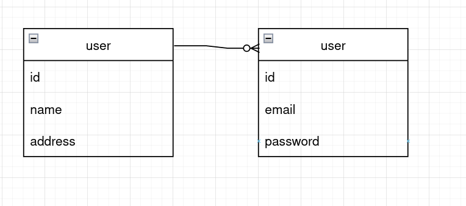
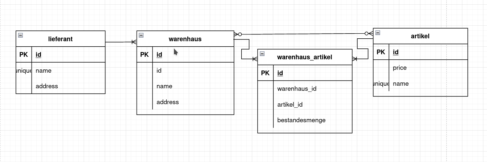

# Aufgabe 1 (ER-Diagrammubersetzen) 
## Ubersetzen Sie folgendes ER-Diagramm in ein Datenbankschema

## solution 

```sql

CREATE TABLE employee (
	ss_num INTEGER PRIMARY KEY,
	name TEXT NOT NULL,
	address TEXT NOT NULL,
);

CREATE TABLE car (
	license INTEGER PRIMARY KEY,
	model TEXT NOT NULL,
);

CREATE TABLE sold (
	employee_ss_num INTEGER NOT NULL,
	car_license INTEGER NOT NULL,
	price FLOAT NOT NULL,
	date DATE NOT NULL,
    FOREIGN KEY (car_license)
       REFERENCES car (car_license)
    FOREIGN KEY (employee_ss_num)
       REFERENCES employee (employee_ss_num) 
);

CREATE TABLE repair_job (
	id INTEGER PRIMARY KEY,
	description TEXT NOT NULL,
);

CREATE TABLE repairs (
	car_license INTEGER NOT NULL,
	repair_job_id INTEGER NOT NULL,
    FOREIGN KEY (car_license)
       REFERENCES car (car_license)
    FOREIGN KEY (repair_job_id)
       REFERENCES repair_job (repair_job_id)
);

CREATE TABLE does (
	employee_ss_num INTEGER NOT NULL,
	repair_job_id INTEGER NOT NULL,
    FOREIGN KEY (employee_ss_num)
       REFERENCES employee (employee_ss_num) 
    FOREIGN KEY (repair_job_id)
       REFERENCES repair_job (repair_job_id)
);

CREATE TABLE replaces (
	employee_ss_num INTEGER NOT NULL,
    FOREIGN KEY (employee_ss_num)
       REFERENCES employee (employee_ss_num) 
);
```


# Aufgabe 2 (Verst ̈andnis ER-Diagramm)
1. In einem ER-Diagramm muss eine Entit ̈at durch ihre Attribute eindeutig identifi-zierbar sein. Geben Sie ein Beispiel fur ein Diagramm, welches diese Regel verletzt ̈(also kein ER-Diagramm ist).
## solution
das attribuite `id` ist redundant


1. .In einem ER-Diagramm muss ein Relationship durch die teilnehmenden Entit ̈ateneindeutig identifizierbar sein. Geben Sie ein ein Beispiel fur ein Diagramm, welches ̈diese Regel verletzt (also kein ER-Diagramm ist
## solution
die entitaet/das model `user` ist redundant




# Aufgabe 3 (ER-Diagramm erstellen fur Warenhaus) 
Die Lagerverwaltung eines Warenhauses will eine Datenbankuber ihre Lieferanten. F ̈ur ̈jeden Lieferanten soll ersichtlich sein, welchen Artikel er zu welchem Preis liefern kann.Lieferanten haben eindeutige Namen. Artikel haben eindeutige Artikelnummern, sowieBezeichnungen.

## solution 
1. erd diagram

2. schema
```sql 
CREATE TABLE liferant (
	id INTEGER PRIMARY KEY,
	name TEXT NOT NULL,
	address TEXT NOT NULL,
);


CREATE TABLE warenhaus (
	id INTEGER PRIMARY KEY,
	name TEXT NOT NULL,
	address TEXT NOT NULL,
);

CREATE TABLE artikel (
	id INTEGER PRIMARY KEY,
	price FLOAT NOT NULL,
	name UNIQUE TEXT NOT NULL,
);
CREATE TABLE warenhaus_artikel (
	warenhaus_id INTEGER NOT NULL,
	artikel_id INTEGER NOT NULL,
    bestandesmenge INTEGER NOT NULL
    FOREIGN KEY (warenhaus_id)
       REFERENCES warenhaus (warenhaus_id)
    FOREIGN KEY (artikel_id)
       REFERENCES artikel (artikel_id) 
);

```

# Aufgabe 4 (ER-Diagramm fur Warenhaus erweitern)
Die Datenbank des Warenhauses aus der letzten Aufgabe soll erweitert werden.
Fur jeden verkauften Artikel sollen der Verkaufspreis und das Verkaufsdatum gespeichert ̈werden. Falls der Artikel versendet wurde, dann soll zus ̈atzlich noch das Versendedatumgespeichert werden.

## solution 
1. erd diagram

2. schema
```sql 
CREATE TABLE verkauf (
	id INTEGER PRIMARY KEY,
	price FLOAT NOT NULL,
	warenhaus_id INTEGER NOT NULL,
	artikel_id INTEGER NOT NULL,
    FOREIGN KEY (warenhaus_id)
       REFERENCES warenhaus (warenhaus_id)
    FOREIGN KEY (artikel_id)
       REFERENCES artikel (artikel_id)
);

CREATE TABLE versand (
	id INTEGER PRIMARY KEY,
	verkauf_id FLOAT NOT NULL,
    FOREIGN KEY (verkauf_id)
       REFERENCES verkauf (verkauf_id)
);


```

